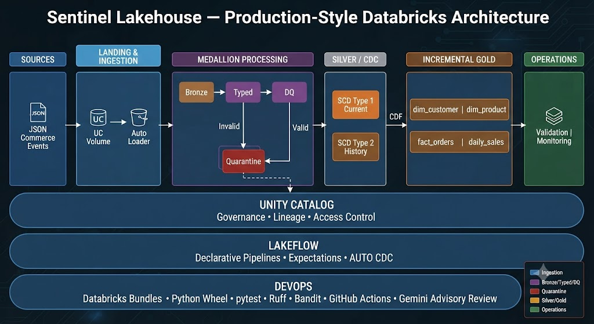

# Sentinel Lakehouse

> A production-style Databricks lakehouse demonstrating incremental ingestion, data quality, CDC, dimensional modeling, performance engineering, observability, governance, packaging, and CI/CD.

Sentinel Lakehouse is an end-to-end data engineering project built on Databricks to model how a commerce data platform can evolve from raw file ingestion into a governed, production-ready analytical lakehouse.

Rather than focusing only on moving data from Bronze to Gold, the project addresses the engineering concerns that appear in real production systems: schema evolution, malformed records, data quality enforcement, late-arriving events, historical state tracking, incremental processing, idempotency, performance, deployment automation, testing, and operational visibility.

---

## Architecture



### Cross-cutting platform capabilities

**Unity Catalog** provides governance and namespace management.  
**Lakeflow Spark Declarative Pipelines** manages ingestion, expectations, and CDC.  
**Declarative Automation Bundles** provide repeatable deployment.  
**Python wheels + pytest** provide reusable, testable application logic.  
**GitHub Actions** enforce automated PR validation.  
**Gemini AI review** provides an additional advisory review layer.

---

## What the Project Demonstrates

### Incremental ingestion with Auto Loader

Raw commerce order events land in a Unity Catalog managed volume and are incrementally ingested using Databricks Auto Loader.

The ingestion layer supports:

- schema inference and evolution
- rescued data for malformed or unexpected fields
- source-file metadata capture
- ingestion timestamps
- incremental file discovery

This provides a resilient Bronze layer without assuming every incoming record is perfectly structured.

---

### Data Quality Framework

Incoming values are safely converted into business types using `try_cast` before quality rules are evaluated.

The Silver pipeline applies a reusable data quality contract using Lakeflow Expectations.

Records are classified into two paths:

```text
Incoming Record
      │
      ▼
Data Quality Contract
   ┌──────┴──────┐
   ▼             ▼
 Valid         Invalid
   │             │
Silver        Quarantine
```

Quality rules validate business identifiers, quantities, prices, amounts, order status, payment method, timestamps, and order-value consistency.

Invalid records are retained in a quarantine dataset together with the failed rule information rather than silently disappearing from the platform.

---

## CDC and Historical State

Commerce orders change state over time:

```text
PLACED
   ↓
CONFIRMED
   ↓
SHIPPED
   ↓
DELIVERED
```

Sentinel maintains both operational views of this data.

### SCD Type 1 — Current State

`silver_orders_current`

Maintains one current version of each `order_id`.

Useful when downstream consumers need the latest known order state.

### SCD Type 2 — Historical State

`silver_orders_history`

Preserves previous versions of an order and its state transitions.

This allows historical analysis and auditing without reconstructing state from the latest record.

Both are maintained using Lakeflow AUTO CDC with the business event timestamp as the sequencing column.

This also protects the current-state table from being incorrectly regressed by late-arriving older events.

---

## Incremental Gold Processing with Change Data Feed

Gold processing does not rebuild the complete fact table for every run.

Delta Change Data Feed is enabled on the Silver current-state table.

Sentinel maintains a processing checkpoint containing the last successfully processed Delta version.

Each Gold run:

1. reads the previous checkpoint
2. determines the current Silver version
3. freezes the processing range
4. reads only relevant CDF changes
5. selects inserts and update post-images
6. deduplicates multiple changes for the same order
7. resolves dimensional keys
8. MERGEs changes into the Gold fact table
9. advances the checkpoint only after a successful MERGE

This design provides incremental processing while reducing the risk of data loss caused by prematurely advancing a watermark.

---

## Dimensional Model

The Gold layer exposes analytics-oriented datasets:

| Table | Purpose |
|---|---|
| `dim_customer` | Customer dimension |
| `dim_product` | Product dimension |
| `fact_orders` | Current validated order facts |
| `daily_sales` | Aggregated daily sales metrics |

The fact table uses surrogate dimension keys and typed business measures.

The model follows a star-schema approach optimized for analytical consumption.

---

## Data Validation

The production workflow includes explicit validation gates before a successful run is considered complete.

Validation checks include:

- duplicate `order_id` detection
- unresolved dimension keys
- invalid quantities
- invalid prices and amounts
- Silver-to-Gold record reconciliation

Validation failures raise an exception and prevent downstream workflow completion.

This makes validation part of orchestration rather than a passive dashboard observed after bad data has already propagated.

---

## Observability

Each successful production run records a health snapshot in:

`sentinel_dev.monitoring.pipeline_health`

Metrics include:

- current order count
- historical version count
- validated record count
- quarantined record count
- data quality pass rate
- Gold record count
- latest ingestion timestamp
- latest business-event timestamp
- metric timestamp

This provides a lightweight operational history of pipeline health and data movement.

---

## Performance Engineering

A larger synthetic Gold workload was generated to evaluate query behavior.

The performance experiment compared filtering before and after clustering by `customer_key`.

Observed result:

| Metric | Before | After |
|---|---:|---:|
| Tasks | 8 | 1 |
| Data read | 15.73 MB | 11.92 MB |
| Runtime | 699 ms | 1.399 s |

Clustering reduced bytes scanned by approximately **24%**, although runtime increased for this small/serverless test workload.

The result is intentionally retained rather than presented as a guaranteed performance improvement: physical optimization must be evaluated using workload characteristics, data volume, caching, and compute overhead rather than query duration alone.

---

## Production Orchestration

The production DAG is deployed through Databricks Declarative Automation Bundles.

```text
silver_pipeline
       │
       ▼
incremental_gold
       │
       ▼
validate_gold
       │
       ▼
pipeline_observability
```

A downstream task cannot execute successfully if its upstream dependency fails.

The same bundle definition can be validated and deployed through the CLI:

```bash
databricks bundle validate --target dev
databricks bundle deploy --target dev
databricks bundle run sentinel_production --target dev
```

Environment-specific configuration is passed into the pipeline rather than embedded directly into production application code.

---

## Python Packaging

Reusable application logic is packaged separately from the Lakeflow pipeline entry point.

```text
src/
├── pipelines/
│   └── orders_pipeline.py
│
└── sentinel/
    └── quality/
        └── orders.py
```

The `sentinel` package is built as a Python wheel and installed as a Lakeflow environment dependency.

```python
from sentinel.quality.orders import ORDER_RULES
```

This allows the production pipeline and automated tests to consume the same quality contract without relying on workspace-specific `sys.path` manipulation.

The wheel lifecycle is:

```text
Shared Python Source
        ↓
Wheel Build
        ↓
CI Installation + Tests
        ↓
Bundle Artifact
        ↓
Lakeflow Environment
        ↓
Production Pipeline
```

---

## CI/CD and Pull Request Governance

GitHub Actions validates every pull request targeting `main`.

The PR workflow performs:

- Python compilation
- Ruff static analysis
- Bandit security analysis
- wheel build validation
- package installation
- pytest execution
- YAML validation
- required artifact validation
- architecture validation
- AI-assisted code review
- final PR validation summary

```text
Feature Branch
      │
      ▼
Pull Request
      │
      ├── Code Quality
      ├── Unit Tests
      ├── Architecture Validation
      ├── Gemini AI Review
      └── PR Validation Gate
               │
               ▼
              main
```

Deterministic engineering checks are required before merge.

The Gemini review is intentionally advisory. AI-generated findings require human interpretation and do not replace deterministic validation or engineering judgment.

---

## Testing Strategy

Sentinel uses multiple validation layers rather than relying on a single test type.

### Unit tests

`pytest` validates reusable Python components such as the production data quality contract.

### Pipeline expectations

Lakeflow Expectations validate records during processing and expose quality failures.

### Integration validation

The Gold validation notebook verifies cross-layer consistency after incremental processing.

### Deployment validation

The Databricks Bundle is validated, deployed, and executed against the Databricks environment to catch issues that static CI cannot detect.

One example occurred during development when local tests passed but Lakeflow exposed a Python module-resolution boundary. Shared quality logic was subsequently packaged as an installable wheel instead of relying on workspace-specific path manipulation.

---

## Governance

Unity Catalog is used as the governance boundary for the lakehouse.

The project documents a least-privilege access model for:

- data engineers
- analysts
- pipeline/service identities
- monitoring and operations users

The intended model separates processing access, Gold consumption, and operational monitoring responsibilities.

Some identity and permission scenarios are documented rather than fully provisioned because the project is developed in a constrained Databricks environment.

---

## Repository Structure

```text
sentinel-lakehouse/
│
├── .github/
│   └── workflows/
│       ├── ci.yml
│       ├── pr-validation.yml
│       └── deploy.yml
│
├── notebooks/
│   ├── 00_platform_setup.ipynb
│   ├── 01_generate_source_data.ipynb
│   ├── 02_bronze_orders_autoloader.ipynb
│   ├── 03_silver_orders_quality.ipynb
│   ├── 04_validate_cdc.ipynb
│   ├── 05_pipeline_observability.ipynb
│   ├── 06_gold_dimensional_model.ipynb
│   ├── 06_gold_dimensional_model_incremental.ipynb
│   ├── 07_performance_engineering.ipynb
│   ├── 08_generate_performance_data.ipynb
│   ├── 09_incremental_gold_cdf.ipynb
│   ├── 10_validate_gold.ipynb
│   ├── 11_pipeline_observability.ipynb
│   └── 12_unity_catalog_governance.ipynb
│
├── resources/
│   ├── sentinel_job.yml
│   └── sentinel_pipeline.yml
│
├── src/
│   ├── pipelines/
│   │   └── orders_pipeline.py
│   └── sentinel/
│       └── quality/
│           └── orders.py
│
├── tests/
│   └── test_orders_quality.py
│
├── databricks.yml
├── pyproject.toml
└── README.md
```

---

## Engineering Decisions & Trade-offs

This project intentionally documents engineering trade-offs rather than presenting every implementation choice as universally optimal.

**Business-event sequencing over ingestion time**  
CDC sequencing uses the business event timestamp so a late-arriving older event does not overwrite a newer business state.

**Quarantine over silent record dropping**  
Invalid records remain inspectable and auditable.

**CDF over repeated full Gold rebuilds**  
Incremental processing limits work to changed records while retaining an explicit recovery checkpoint.

**Checkpoint advancement after successful MERGE**  
Processing state is updated only after the target write succeeds.

**Both SCD Type 1 and Type 2**  
Current-state and historical analytical requirements are modeled separately.

**Wheel packaging over `sys.path` manipulation**  
Reusable production code is deployed as an explicit dependency rather than relying on workspace filesystem assumptions.

**AI review as advisory**  
Probabilistic AI feedback complements deterministic CI but does not become the source of truth for merge safety.

**Performance measured rather than assumed**  
Clustering reduced bytes scanned in the experiment but did not reduce runtime for the small test workload.

---

## Technology Stack

- Databricks
- Apache Spark / PySpark
- Delta Lake
- Lakeflow Spark Declarative Pipelines
- Auto Loader
- Delta Change Data Feed
- Unity Catalog
- Declarative Automation Bundles
- Python
- pytest
- Ruff
- Bandit
- GitHub Actions
- Gemini API

---

## Key Engineering Concepts Demonstrated

`Medallion Architecture` · `Auto Loader` · `Schema Evolution` · `Data Quality` · `Quarantine` · `CDC` · `SCD Type 1` · `SCD Type 2` · `Delta Change Data Feed` · `Incremental Processing` · `MERGE` · `Idempotency` · `Dimensional Modeling` · `Performance Engineering` · `Observability` · `Unity Catalog` · `Python Packaging` · `CI/CD` · `Infrastructure as Code`

---

## Project Status

**v1 — Feature Complete**

The core engineering lifecycle has been implemented and validated end-to-end:

**Ingest → Validate → Track Change → Model → Optimize → Orchestrate → Observe → Govern → Test → Deploy**

The project is designed as a portfolio implementation of production-oriented Databricks data engineering patterns rather than a production system serving real customer data.

---

## Author

**Mansi Dhruv**

Data Engineer · Data Architecture · Lakehouse Engineering